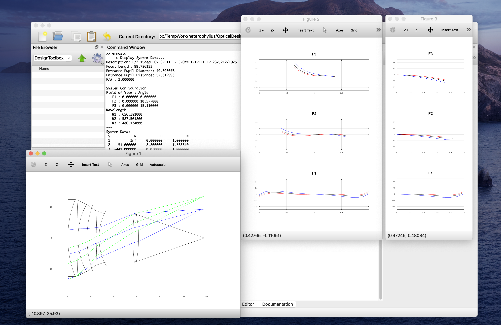

# Matlab/Octave Toolbox for Optical Design

## The Repository
This repository is attempting to create Matlab/Octave toolbox for optical design based on geometrical ray tracing.

_This project is just started up and work in progress._

## Motivation
+ Understand optical simulation method
  - Optical design is today greatly aided by powerful computers and software. The evolution of such tools fascilitates more and more sophisticated design.  In practice, it is true that any optical design process can be completed without involving non-essential matters. The designer, however, should be able to understand or verify the output result so as to have responsibility for the deliverables. Knowing the inside of the simulation codes and experiencing to implement by ourselves would cultivate our theoretical and methodological skills.

+ Create the consistent environment
  - The commercial software widely used for optical design (Zemax, CODE V, etc) are too expensive for personal use, so more affordable ones are strongly needed. Matlab/Octave could be one reasonable solution. For, Matlab is one of the most versatile environments for numerical computing, and Octave is known as its open-source alternative. Although the other programming languages are rapidly growing up, the rich and stable resources of Matlab/Octave are still significant. Their plenty of built-in functions will be promising to create a consistent environment for diverse optical simulation.

## Getting Started
1. Download
2. addpath(genpath('path to the toolbox'));
3. importAGF('path to AGF'); % for the first time

Simple tests are in 'Example' folder.

## License
This project is licensed under MIT license - see the [LICENSE](LICENSE) file for details.

## Contributing
Contributions and feedbacks are greatly appreciated.

Please read [CONTRIBUTING](CONTRIBUTING.md) for details on our code of conduct, and the process for submitting pull requests to us.
